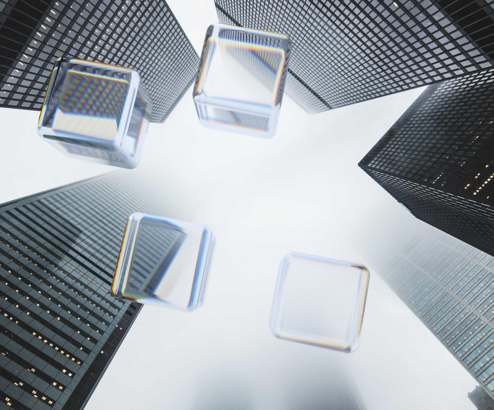
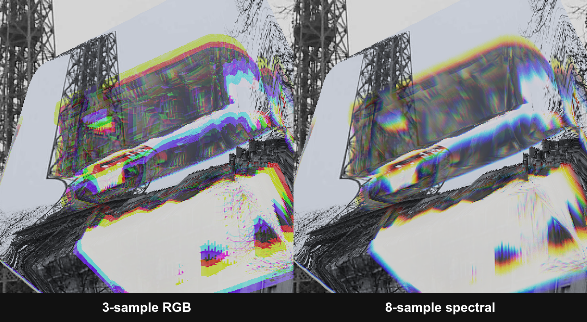

# Spectral Glass

> **Live demo**: <https://saqoosha.github.io/spectral-glass/> (Chrome/Edge 120+ or Safari 18+)

A realtime WebGPU demo of **physically accurate spectral dispersion** through
Apple "Liquid Glass"-style floating pills, triangular prisms, rotating cubes,
tumbling wavy plates, and round brilliant cut diamonds. Unlike the common
"shift R/G/B IORs" hack that most web implementations use (including Three.js's
`MeshPhysicalMaterial.dispersion`), this samples the full visible spectrum
per-wavelength and reconstructs the final color via CIE 1931 color matching
functions.



Above: four rotating glass cubes (Rainbow soap material, `n_d = 1.272`,
`V_d = 2.0`, perspective FOV 60°, N = 16) over a grayscale Picsum photo.
A monochrome background lets you see the per-wavelength dispersion as pure
spectral colors instead of mixing with the photo's own chroma — every band
on the cube is the shader splitting the photo by wavelength in real time at
60 fps.

Below: same cubes against a Paris streetscape — top-left cube shows a full
red→blue spectrum where the back-face exit lands on the bright sky.


## Why not just shift R/G/B?

A 3-sample RGB IOR is visibly a *three-band* rainbow. Real glass is a continuous
spectrum. When dispersion is strong you can see the difference — the 3-sample
version produces hard R/G/B fringing along every refraction edge, while the
8-sample spectral version resolves into a continuous rainbow.



Left: `N = 3`, with per-pixel jitter and temporal accumulation disabled so the
underlying 3-band structure is visible. Right: `N = 8` with the spectral pipeline
fully on (stratified jitter + CIE reconstruction + EMA history). Same rotating
glass cube (`n_d = 1.7`, `V_d = 4`), same grayscale background photo, same
frame — only the per-wavelength sample count and the smoothing pipeline differ.

In the live demo, press and hold **`Z`** to force `N = 3`. Release to go back to
`N = 8`. With jitter + history on, even `N = 3` looks close to `N = 8` at
typical dispersion strengths — the 3-band rainbow only shows up cleanly when
both are off (which is what the image above captures for illustration).

## Quick start

```bash
bun install
bun run dev        # http://localhost:5173
bun run test       # Vitest on the math modules
bun run build      # tsc --noEmit + vite build
```

Requires a WebGPU-capable browser (Chrome / Edge 120+, Safari 18+).

## Controls

| Input | Action |
|---|---|
| Drag a shape | Move it around the canvas (cube / diamond use a circular hit radius) |
| **`Z`** (hold) | Force `N = 3` (fake RGB dispersion) for A/B comparison |
| **Space** | Shuffle pills to random positions |
| **`R`** | Reload a new random Picsum photo |
| **`T` / `S` / `B` / `F`** | Diamond view presets — **T**op (table toward camera) / **S**ide (girdle profile) / **B**ottom (culet toward camera) / **F**ree (tumble). No-op for other shapes. |
| Tweakpane | IOR, Abbe, sample count, shape (pill / prism / cube / plate / diamond), dimensions, wave amp + wavelength (plate only), **diamond size** + view preset + **Wireframe** / **Facet color** debug overlays (diamond only), refraction strength, projection (ortho / perspective), FOV, temporal jitter, refraction mode, **Stop the world** (freeze rotation/wave while AA keeps converging), **AA** mode selector — `None` / `FXAA` (single-frame spatial filter) / `TAA` (sub-pixel jitter + motion-vector history reprojection) |
| Presets | Subtle pill · Strong dispersion · Prism rainbow · Rotating cube · Wavy plate |
| Materials | 10 real-world glasses (water → BK7 → SF flints → diamond → moissanite) + 4 fantasy (n_d up to 3.5, V_d down to 2) |

Add `?perf=1` to the URL to enable the GPU timestamp HUD — timings are
published on `window._perf.samples`. Check **Show proxy** in the UI to tint
every proxy fragment pink and see the rasterised silhouette.

## Technical approach

- **WebGPU + WGSL, two-pass.** Cheap fullscreen bg pass (photo + history)
  followed by an instanced 3D-cube mesh proxy per pill. The heavy per-pixel
  refraction shader only runs on fragments inside the proxy silhouette.
  Back-face culling (CCW-outward 3D → CW NDC after Y-flip) gives exactly one
  invocation per covered pixel.
- **3D SDFs, five shapes.** Pill (stadium XY + rounded Z), prism
  (isosceles triangle in YZ extruded in X), rotating cube (rounded box +
  per-frame `rot * (p - center)` via `cubeRotation(time)`), tumbling
  **wavy plate** — a thick square slab whose midsurface bends in Z along
  `waveAmp · sin(kx+t) · sin(ky+t)` while both faces ride that midsurface
  together, keeping thickness uniform — and a **round brilliant cut
  diamond** (58-facet Tolkowsky-ideal polytope, D_8-folded to 5 plane
  evaluations + table cap + girdle cylinder). Cube, plate, and diamond
  proxy corners are transformed by `transpose(rot)` so the rasterised
  silhouette tracks the shader's rotation exactly — no √3 bounding-box
  slack. Diamond ships its own 46-triangle exact-hull proxy instead of the
  cube AABB the other shapes use, so sharp-facet silhouettes don't waste
  fragments on AABB slack.
- **Ortho or perspective projection.** UI toggle. Ortho keeps the flat Liquid
  Glass aesthetic; perspective uses a pinhole camera at `(w/2, h/2, cameraZ)`
  with `cameraZ = (height/2) / tan(fov/2)` derived from the user-facing FOV.
- **Cauchy + Abbe IOR.** Wavelength-dependent index via the glTF
  `KHR_materials_dispersion` formula.
- **Wyman-Sloan-Shirley CIE XYZ** (JCGT 2013) analytic approximation — no
  lookup tables.
- **Two-surface refraction.** Front hit via primary sphere-trace, back exit via
  per-wavelength inside-trace (Exact mode) or shared hero-wavelength trace
  (Approx mode, Wilkie 2014). Cube and plate both skip the inside-trace
  entirely — their back-face exit is an analytical slab intersection (plus
  Newton refinement for plate's wavy surface), ≈ 10× fewer SDF evals per
  wavelength than pill / prism.
- **Per-wavelength Fresnel.** Blue λ has higher IOR → higher Schlick Fresnel
  → visible blue-tinged rim on diamonds and prisms (the classic "fire" of
  high-index crystals).
- **Per-wavelength sRGB weighting.** Each sampled photo pixel is weighted by
  `xyzToSrgb(cmf(λ))` — short-wavelength samples contribute to blue, long to
  red. This preserves photo color when refraction UVs coincide and produces
  real chromatic fringing where they diverge.
- **Spatial + temporal jitter.** Per-pixel wavelength phase via `hash21` so
  neighbouring pixels sample different λ — the eye and history accumulation
  average the noise, so N=8 stratified looks like N=16 uniform.
- **TIR fallback.** When `refract()` returns zero at the back face, the
  wavelength contributes the external reflection instead of dropping — no
  black holes inside the cube.
- **Temporal accumulation.** `rgba16float` ping-pong history with EMA blend
  (α = 0.2 steady-state, 1.0 for one frame after a scene change so cube
  tail doesn't ghost in). When **Stop the world** freezes the scene, the
  blend switches to progressive averaging α = max(1/n, 1/256) — noise
  drops as 1/√n in the convergence ramp and bottoms out at a 256-sample
  sliding window (~6 % residual). The 1/256 floor is required by fp16
  precision so that small new-sample contributions don't round to zero
  and slowly fade silhouettes to black; see `main.ts pausedFrames` for
  the full derivation.
- **Temporal AA with motion-vector reprojection.** Each frame's primary
  ray is sub-pixel-jittered by a per-pixel hash; history is read at
  `fragCoord + (projected_prev_world − projected_curr_world)` so the
  jitter cancels and only the rotation-driven world motion shifts the
  read. Stationary scenes read history at exactly the pixel centre — no
  iterated bilinear blur — while tumbling cubes and plates keep their
  refracted texture sharp under motion. The host pre-computes both the
  current and previous frame's `cubeRot` / `plateRot` and uploads them as
  uniforms; cube and plate get analytic-exit reprojection, pill / prism
  fall back to the unreprojected read.
- **Post-process pass.** Scene writes linear `rgba16float` into a canvas-sized
  intermediate; a second pass copies or FXAA-filters it to the swapchain
  depending on the AA mode. The sRGB OETF is applied once there (identity
  when the swapchain is already `*-srgb`), so both FXAA and the scene share
  the same linear pixels and the encoding isn't scattered across shaders.
- **FXAA (optional).** 9-tap FXAA 3.x in the post pass — luma computed in
  perceptual (sRGB) space for edge detection, color blended in linear space.
  Alternative to TAA: no temporal jitter, zero ghosting, slightly softer
  edges. `~0.3 ms` at 1080p.
- **Photo mipmaps.** Uploaded photo carries a full mip chain (fullscreen-blit
  downsample). Per-wavelength refraction sample picks an LOD from two terms:
  `-log2(cosT) - 1` (grazing-angle minification) plus `(1 - max(|nLocal|)) ·
  8` on cube / plate to handle rounded-rim normal-turn aliasing. Clamped to
  `[0, 6]`.
- **localStorage persistence.** Validated load (rejects NaN / bogus enums),
  legacy `taa: boolean` → `aaMode` migration for older payloads,
  trailing-edge debounced save, pagehide flush.

## Project structure

```
src/
├── main.ts                     Frame loop + glue (+ T/S/B/F diamond-view hotkeys)
├── math/                       Pure math modules (unit-tested)
│   ├── cauchy.ts               Wavelength → IOR (glTF formulation)
│   ├── wyman.ts                Wyman CIE XYZ approximation
│   ├── srgb.ts                 XYZ → linear sRGB matrix + OETF
│   ├── sdfPill.ts              3D pill SDF (mirrors WGSL version)
│   ├── sdfPrism.ts             Triangular prism SDF (mirrors WGSL version)
│   ├── sdfCube.ts              Rounded box / cube SDF (mirrors WGSL version)
│   ├── cube.ts                 rz·rx rotation columns for the tumbling cube
│   ├── plate.ts                rx·ry rotation columns for the tumbling plate
│   └── diamond.ts              Tolkowsky-ideal brilliant-cut proportions,
│                               facet-plane derivations, WGSL `const` emitter,
│                               tumble + fixed-view rotation matrices
├── persistence.ts              localStorage: validated load, debounced save, pagehide flush
├── photo.ts                    Picsum fetch → GPU texture (w/ gradient fallback)
├── pills.ts                    Pill state + shape-aware pointer drag
├── ui.ts                       Tweakpane bindings (shape selector, presets, materials)
├── webgpu/
│   ├── device.ts               Adapter + device + error handlers
│   ├── history.ts              Ping-pong history textures
│   ├── pipeline.ts             Bg + proxy pipelines + shared bind groups + encodeScene
│   ├── postprocess.ts          Intermediate rgba16f target + passthrough/FXAA pipelines + encodePost
│   ├── mipmap.ts               Fullscreen-blit mipmap generator (used by photo.ts)
│   ├── perf.ts                 GPU timestamp harness (?perf=1)
│   └── uniforms.ts             Typed uniform buffer writer
└── shaders/
    ├── fullscreen.wgsl         Fullscreen triangle vertex shader
    ├── postprocess.wgsl        Passthrough + FXAA fragment shaders + sRGB OETF
    ├── dispersion.wgsl         SDFs (pill/prism/cube/plate) + analytic exits + TAA reprojection + spectral dispersion fragment
    └── diamond.wgsl            Diamond-specific WGSL: `sdfDiamond` (D_8 folded),
                                 wireframe + facet-colour debug overlays, exact
                                 convex-hull proxy mesh, TAA pill-index picker

tests/                          Vitest unit tests for each math module
docs/
└── ARCHITECTURE.md             Frame path, uniform layout, SDF & tracing details
```

Math modules in `src/math/` are mirrored 1:1 by functions in
`src/shaders/dispersion.wgsl` and `src/shaders/diamond.wgsl` — the vitest
suite (~85 tests, exact count drifts as cases are added) acts as the
reference implementation for the shader. The diamond plane coefficients
are injected from `diamond.ts` into the shader source at pipeline build
time so the host-side math and GPU-side constants can't drift.

## Design

- [Architecture notes](docs/ARCHITECTURE.md) — module map, frame path, uniform layout, proxy mesh + camera, per-wavelength loop (spatial stratification, per-λ Fresnel, TIR fallback), measured performance

## Performance

Apple Silicon (1292×1073, 4 shapes, WebGPU `timestamp-query`, p50 of ≥ 30
samples):

| Config | GPU time |
|---|---:|
| pill N=8  | 1.70 ms |
| pill N=32 | 6.42 ms |
| cube N=8  | 1.05 ms |
| cube N=16 | 1.38 ms |
| cube N=32 | 1.97 ms |
| cube N=64 | 3.21 ms |

All within the 16.67 ms vsync budget. Background pixels cost ~nothing; the
per-λ loop dominates on pill / prism / cube / plate pixels. Cube and plate
are noticeably cheaper than pill at the same `N` because their back-face
exits are analytical slab intersections instead of the per-wavelength
sphere-trace pill/prism still pay — plate adds 3 Newton iterations on top
to land on its wavy surface. Apple's TBDR already culls background
efficiently, but discrete GPUs gain more from the proxy pass.

## References

1. Khronos. [**KHR_materials_dispersion**](https://github.com/KhronosGroup/glTF/blob/main/extensions/2.0/Khronos/KHR_materials_dispersion/README.md) — the Cauchy + Abbe formulation used here.
2. Wyman, Sloan, Shirley (2013). [**Simple Analytic Approximations to the CIE XYZ Color Matching Functions.**](https://jcgt.org/published/0002/02/01/) JCGT 2(2).
3. Wilkie et al. (2014). [**Hero Wavelength Spectral Sampling.**](https://jo.dreggn.org/home/2014_herowavelength.pdf) EGSR.
4. Peters (2025). [**Spectral Rendering, Part 2.**](https://momentsingraphics.de/SpectralRendering2Rendering.html)
5. Heckel. [**Refraction, dispersion, and other shader light effects.**](https://blog.maximeheckel.com/posts/refraction-dispersion-and-other-shader-light-effects/)

## Status

Tech demo / proof of technique. Not a library. No production website
integration. If you want to pull the spectral-refraction technique into your
own project, the interesting files are `src/shaders/dispersion.wgsl` and the
six math modules in `src/math/`.
